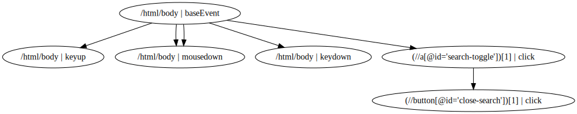

## Browser Interaction Bot (Python)

This is a Python implementation of <a href="https://github.com/TofunmiKupoluyi/Browser-Interaction-Bot">Browser Interaction Bot</a>.
Documentation will be updated but for now, to try sample execution on different sites, run MainExecution.py.

## Sample Event Dependency Output

The browser interaction bot outputs an event dependency graph, currently located in "screenshots" folder, under the name, "output.dot".
A sample event dependency graph for colorado.edu is presented below:

</img>